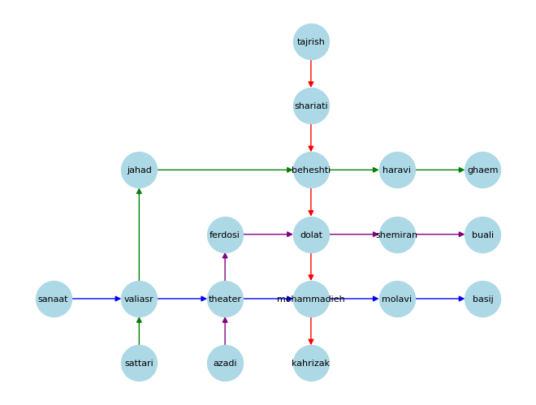

# Metro System Simulation and Traffic Prediction
As a Machine Learning Project, CE Department of Amirkabir University of Technology, Fall 2021

## Overview
This Python code simulates the daily passenger flow within a metro system represented as a directed graph. The simulation generates a dataset capturing the in-flow, out-flow, and line traffic at each station over a specified period. Additionally, the code demonstrates the use of machine learning models, specifically Linear Regression and AdaBoostRegressor, to predict passenger in-flow, out-flow, and line traffic in the metro system.



## Dependencies
- `numpy`
- `pandas`
- `networkx`
- `matplotlib`
- `scikit-learn`

Make sure to install the required dependencies before running the code.

```bash
pip install numpy pandas networkx matplotlib scikit-learn
```

## Code Structure
- The metro system is represented as a directed graph using the NetworkX library.
- Station positions are set, and edges between stations represent metro lines with distinct colors.
- Station rates are defined based on in-degree, out-degree, and the existence of multiple lines.
- The simulation generates a dataset capturing daily passenger flow, considering station connectivity and line traffic.
- The code visualizes input, output, and line traffic for selected stations on the first day.
- One-hot encoding is applied to station names for machine learning model input.
- Linear Regression models are trained to predict passenger in-flow and out-flow.
- An AdaBoostRegressor model is trained to predict line traffic.
- Examples of predictions for specific times and stations are provided.
- The average in-flow and out-flow rates for each station are estimated.

## Usage
1. Install the required dependencies.
2. Run the code to simulate metro system traffic and train machine learning models.
3. Analyze the visualizations and model predictions.

Feel free to customize the code for your specific metro system or use case.
